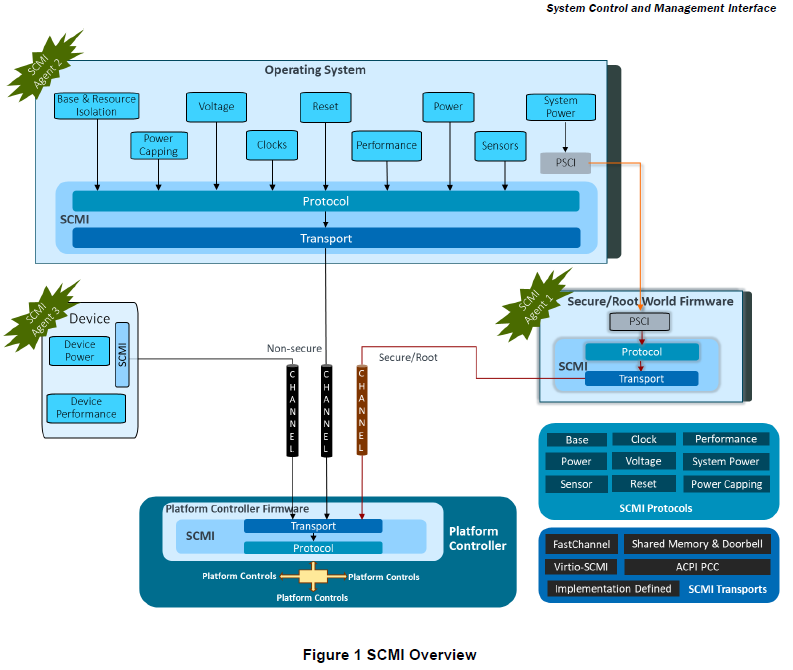

# ARM SCMI 코드 스터디

### 1. SCMI Overview

> This document describes the System Control and Management Interface (SCMI), which is a set of operating system-independent software interfaces that are used in system management.

> 이 문서는 운영체제에 의존하지 않고 시스템 관리에 사용할 수 있는 소프트웨어 인터페이스들인 SCMI (System Control and Management Interface) 에 대해 설명한다.

> There is a strong trend in the industry to provide microcontrollers in systems to abstract various power, or other system management tasks, away from APs. These controllers usually have similar interfaces, both in terms of the functions that are provided by them, and in terms of how requests are communicated to them. The Power Control System Architecture (PCSA) describes how systems using this approach can be built.

> 업계에서는 전원 관리나 시스템 관리들을 AP (Application Processor) 로부터 추출해서 마이크로컨트롤러가 하도록 하는 것이 트렌드이다. 이러한 컨트롤러들은 제공하는 함수들이나 주고받는 요청들에 대해 비슷한 인터페이스를 가지고 있다. PCSA (Power Control System Architecture) 는 이런 접근 방법을 사용해서 어떻게 시스템을 구현하는지를 보여준다. \* PCSA 는 ARM 의 비공개 문서이다.

> PCSA defines the concept of the System Control Processor (SCP), a processor that is used to abstract power and system management tasks from the APs. The SCP can take requests from APs and other system agents. It can coordinate these requests and place components in the platform into appropriate power and performance states.

> PCSA 는 AP 로부터 전원 관리와 시스템 관리를 대신하는 SCP (System Control Processor) 의 컨셉을 정의한다. SCP 는 AP 나 다른 시스템들로부터 오는 요청을 받을 수 있다. SCP 는 이러한 요청들을 조정하고 플랫폼의 요소들을 적절한 전원 상태 및 동작 상태로 만든다.

출처: [SCMI 공식 문서](https://developer.arm.com/documentation/den0056/d/?lang=en)

SCMI Agent 들이 그림 하단의 SCP Firmware 에 SCMI 프로토콜을 통해 원하는 작업을 요청하는 예시

출처: [SCMI 공식 문서](https://developer.arm.com/documentation/den0056/d/?lang=en)

### 2. 코드

[Linux Kernel mainline 6.1-rc5](https://www.kernel.org/)

[SCP Firmware 2.11](https://github.com/ARM-software/SCP-firmware)

