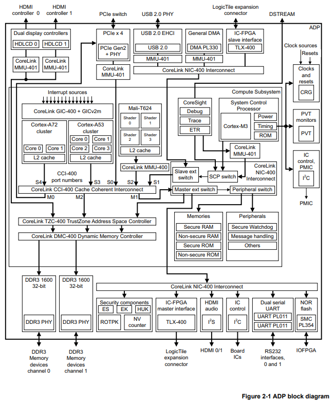
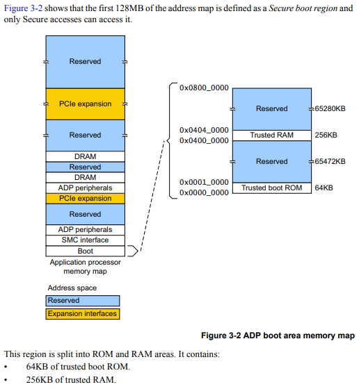

# ARM SCMI 코드 스터디

### 1. SCMI Overview

> This document describes the System Control and Management Interface (SCMI), which is a set of operating system-independent software interfaces that are used in system management.

> 이 문서는 운영체제에 의존하지 않고 시스템 관리에 사용할 수 있는 소프트웨어 인터페이스들인 SCMI (System Control and Management Interface) 에 대해 설명한다.

> There is a strong trend in the industry to provide microcontrollers in systems to abstract various power, or other system management tasks, away from APs. These controllers usually have similar interfaces, both in terms of the functions that are provided by them, and in terms of how requests are communicated to them. The Power Control System Architecture (PCSA) describes how systems using this approach can be built.

> 업계에서는 전원 관리나 시스템 관리들을 AP (Application Processor) 로부터 분리해서 마이크로컨트롤러가 하도록 하는 것이 트렌드이다. 이러한 컨트롤러들은 제공하는 함수들이나 주고받는 요청들에 대해 비슷한 인터페이스를 가지고 있다. PCSA (Power Control System Architecture) 는 이런 접근 방법을 사용해서 어떻게 시스템을 구현하는지를 보여준다. \* PCSA 는 ARM 의 비공개 문서이다.

> PCSA defines the concept of the System Control Processor (SCP), a processor that is used to abstract power and system management tasks from the APs. The SCP can take requests from APs and other system agents. It can coordinate these requests and place components in the platform into appropriate power and performance states.

> PCSA 는 AP 로부터 전원 관리와 시스템 관리를 대신하는 SCP (System Control Processor) 의 컨셉을 정의한다. SCP 는 AP 나 다른 시스템들로부터 오는 요청을 받을 수 있다. SCP 는 이러한 요청들을 조정하고 플랫폼의 요소들을 적절한 전원 상태 및 동작 상태로 만든다.

출처: [SCMI 공식 문서](https://developer.arm.com/documentation/den0056/d/?lang=en)


SCMI Agent 들이 그림 하단의 SCP Firmware 에 SCMI 프로토콜을 통해 원하는 작업을 요청하는 예시

출처: [SCMI 공식 문서](https://developer.arm.com/documentation/den0056/d/?lang=en)


출처: [ARM Community Blog](https://community.arm.com/arm-community-blogs/b/architectures-and-processors-blog/posts/improved-power-management-system-control-through-scmi)


### 2. SCP Firmware Overview

module/ framework/ architecture


#### SCP Firmware Initialization

코드 컴파일시 exceptions 가 가장 앞부분에 위치

arch/arm/arm-m/src/arch.scatter.S

```assembly
LR_FIRMWARE FMW_MEM0_BASE {
    ER_EXCEPTIONS ARCH_X_BASE {
        *(.exceptions)
    }

    ER_TEXT +0 {
        *(+CODE)
    }

    ER_RODATA ARCH_R_BASE {
        *(+CONST)
    }

    ER_DATA ARCH_W_BASE {
        *(+DATA)
    }

    ER_BSS +0 {
        *(+BSS)
    }

    ARM_LIB_STACKHEAP +0 EMPTY (ARCH_W_LIMIT - +0) { }
}
```

exceptions 에서 제일 처음 실행되는 코드는 arch_exception_reset

arch/arm/arm-m/src/arch_exceptions.c

```c
const struct {
    uintptr_t stack;
    uintptr_t exceptions[NVIC_USER_IRQ_OFFSET - 1];
} arch_exceptions FWK_SECTION(".exceptions") = {
    .stack = (uintptr_t)(arch_exception_stack),
    .exceptions = {
        [NVIC_USER_IRQ_OFFSET + Reset_IRQn - 1] =
            (uintptr_t)(arch_exception_reset),
        [NonMaskableInt_IRQn +  (NVIC_USER_IRQ_OFFSET - 1)] =
            (uintptr_t)(arch_exception_invalid),
        [NVIC_USER_IRQ_OFFSET + HardFault_IRQn - 1] =
            (uintptr_t)(arch_exception_invalid),
        [NVIC_USER_IRQ_OFFSET + MemoryManagement_IRQn - 1] =
            (uintptr_t)(arch_exception_invalid),
        [NVIC_USER_IRQ_OFFSET + BusFault_IRQn - 1] =
            (uintptr_t)(arch_exception_invalid),
        [NVIC_USER_IRQ_OFFSET + UsageFault_IRQn - 1] =
            (uintptr_t)(arch_exception_invalid),
#ifdef ARMV8M
        [NVIC_USER_IRQ_OFFSET + SecureFault_IRQn - 1] =
            (uintptr_t)(arch_exception_invalid),
#endif
        [NVIC_USER_IRQ_OFFSET + DebugMonitor_IRQn - 1] =
            (uintptr_t)(arch_exception_invalid),

        [NVIC_USER_IRQ_OFFSET + SVCall_IRQn - 1] =
            (uintptr_t)(arch_exception_invalid),
        [NVIC_USER_IRQ_OFFSET + PendSV_IRQn - 1] =
            (uintptr_t)(arch_exception_invalid),
        [NVIC_USER_IRQ_OFFSET + SysTick_IRQn - 1] =
            (uintptr_t)(arch_exception_invalid),
    },
};
```

arch_exception_reset 은 \_\_main 을 호출하게 되고 라이브러리 함수를 거쳐 최종적으로 main 이 연결된다. [참고](http://recipes.egloos.com/5044366)


arch/arm/arm-m/src/arch_handlers.c

```c
noreturn void arch_exception_reset(void)
{
    /*
     * When entering the firmware, before the framework is entered the following
     * things happen:
     *  1. The toolchain-specific C runtime is initialized
     *     For Arm Compiler:
     *       1. Zero-initialized data is zeroed
     *       2. Initialized data is decompressed and copied
     *     For GCC/Newlib:
     *       1. Zero-initialized data is zeroed
     *       2. Initialized data is copied by software_init_hook()
     * 2. The main() function is called by the C runtime
     */

#ifdef __ARMCC_VERSION
    extern noreturn void __main(void);

    __main();
#else
    extern noreturn void _start(void);

    _start();
#endif
}
```

main 함수를 보면 CCR 레지스터를 설정해주고, framework architecture 초기화 함수를 실행한다.

arch/arm/arm-m/src/arch_main.c

```c

static const struct fwk_arch_init_driver arch_init_driver = {
    .interrupt = arch_nvic_init,
};

static void arch_init_ccr(void)
{
    /*
     * Set up the Configuration Control Register (CCR) in the System Control
     * Block (1) by setting the following flag bits:
     *
     * DIV_0_TRP   [4]: Enable trapping on division by zero. (1)(2)
     * STKALIGN    [9]: Enable automatic DWORD stack-alignment on exception
     *                  entry (3).
     *
     * All other bits are left in their default state.
     *
     * (1) ARM® v7-M Architecture Reference Manual, section B3.2.8.
     * (2) Arm® v8-M Architecture Reference Manual, section D1.2.9.
     * (3) ARM® v7-M Architecture Reference Manual, section B1.5.7.
     */

    SCB->CCR |= SCB_CCR_DIV_0_TRP_Msk;
#ifdef ARMV7M
    SCB->CCR |= SCB_CCR_STKALIGN_Msk;
#endif
}

int main(void)
{
    arch_init_ccr();

    return fwk_arch_init(&arch_init_driver);
}
```


WFE 에서 깨어나 event list 에서 처리할 event 를 꺼내온다.

WFI 와 WFE 의 차이: WFI 는 인터럽트가 발생하면 인터럽트 처리가 시작되지만, WFE 는 깨어나기만 하고 인터럽트를 처리하지는 않는다.

> [WFI 혹은 WFE 명령으로 저전력 모드를 들어갈 수 있는데, 이 둘은 어떤 차이가 있습니까?](https://www.st.com/ko/stm32/stm32/support.html#)
>
> A. WFI는 Wait For Interrupt (인터럽트 대기)의 약자이며, WFE는 Wait For Event (이벤트 대기)의 약자입니다. WFI의 경우 MCU가 저전력 모드에서 복귀 할 때 벡터 인터럽트 컨트롤러 (NVIC)에 의해 인터럽트를 인식하여 인터럽트 처리가 시작됩니다. WFE의 경우 저전력 모드에서에서 복귀 할 때 인터럽트 처리를하지 않고 저전력 모드에서 복귀만 하게됩니다. 따라서 저전력 모드에서 복귀 할 때 WFI를 사용할지 혹은 WFE을 사용할지 저전력 모드로 들어가기 전에 사용자가 컨트롤 해야 합니다.


#### shared memory

arch/arm64/boot/dts/arm/juno-base.dtsi (linux-6.1-rc5)

```c
        sram: sram@2e000000 {
                compatible = "arm,juno-sram-ns", "mmio-sram";
                reg = <0x0 0x2e000000 0x0 0x8000>;

                #address-cells = <1>;
                #size-cells = <1>;
                ranges = <0 0x0 0x2e000000 0x8000>;

                cpu_scp_lpri: scp-sram@0 {
                        compatible = "arm,juno-scp-shmem";
                        reg = <0x0 0x200>;
                };

                cpu_scp_hpri: scp-sram@200 {
                        compatible = "arm,juno-scp-shmem";
                        reg = <0x200 0x200>;
                };
        };
```

arch/arm64/boot/dts/arm/juno-scmi.dtsi (linux-6.1-rc5)

```c
        firmware {
                scmi {
                        compatible = "arm,scmi";
                        mbox-names = "tx", "rx";
                        mboxes = <&mailbox 0 0 &mailbox 0 1>;
                        shmem = <&cpu_scp_lpri0 &cpu_scp_lpri1>;
                        #address-cells = <1>;
                        #size-cells = <0>;

                        scmi_devpd: protocol@11 {
                                reg = <0x11>;
                                #power-domain-cells = <1>;
                        };

                        scmi_dvfs: protocol@13 {
                                reg = <0x13>;
                                #clock-cells = <1>;
                                mbox-names = "tx", "rx";
                                mboxes = <&mailbox 1 0 &mailbox 1 1>;
                                shmem = <&cpu_scp_hpri0 &cpu_scp_hpri1>;
                        };

                        scmi_clk: protocol@14 {
                                reg = <0x14>;
                                #clock-cells = <1>;
                        };

                        scmi_sensors0: protocol@15 {
                                reg = <0x15>;
                                #thermal-sensor-cells = <1>;
                        };
                };
        };
```


### 3. ARM JUNO Board

Juno r2 ARM Development Platform SoC Technical Reference Manual

https://developer.arm.com/documentation/ddi0515/f/

ADP (ARM Development Platform) 는 Linux 나 Android 와 같이 Linaro 기반 커널들에 대한 개발 및 테스트가 가능하도록 만들어진 플랫폼이다.

> The ADP SoC is a development chip that is implemented on the TSMC 28HPM process and delivers the following: 
>
> • A platform for ARMv8-A software and tool development to enable robust testing of software deliverables on Linaro-based kernels such as Linux and Android.



ADP 의 내부 중 SCP 가 사용하는 메모리 영역은 아래와 같다.

> A Cortex-M3-based SCP designed to function as a trusted subsystem. This subsystem also includes: 
>
> — A local trusted on-chip ROM. 
>
> — Support for a local trusted on-chip SRAM to execute the main SCP firmware.

Trusted RAM 은 256 KB, Trusted ROM 은 64 KB



Non-trusted SRAM 은 32KB, Non-trusted ROM 은 4KB

)


### 4. OP TEE

STM32 에서 개발한 SCMI Overview (위키 문서)

https://wiki.st.com/stm32mpu/wiki/SCMI_overview

Arm Trusted Firmware 코드

```text
commit 제목: drivers/scmi-msg: smt entry points for incoming messages
This change implements SCMI channels for reading a SCMI message from a
shared memory and call the SCMI message drivers to route the message
to the target platform services.

SMT refers to the shared memory management protocol which is used
to get/put message/response in shared memory. SMT is a 28byte header
stating shared memory state and exchanged protocol data.
```

https://github.com/renesas-rcar/arm-trusted-firmware/commit/7d6fa6ecbe6212480ad656731eeddf84291aeba5

OP TEE os 코드

```text
commit 제목: drivers/scmi-msg: smt entry points for incoming messages
This change implements SCMI channels for reading a SCMI message from a
shared memory and call the SCMI message drivers to route the message
to the target platform services.

SMT refers to the shared memory management protocol which is used
to get/put message/response in shared memory. SMT is a 28byte header
stating shared memory state and exchanged protocol data.

The processing entry for a SCMI message can be a secure interrupt
(CFG_SCMI_MSG_SMT_INTERRUPT_ENTRY=y), and fastcall SMC
(CFG_SCMI_MSG_SMT_FASTCALL_ENTRY=y) or a threaded execution
context entry (CFG_SCMI_MSG_SMT_THREAD_ENTRY=y).
```

https://github.com/OP-TEE/optee_os/commit/a58c4d706d2333d2b21a3eba7e2ec0cb257bca1d


### 4. 코드

[Linux Kernel mainline 6.1-rc5](https://www.kernel.org/)

[SCP Firmware 2.11](https://github.com/ARM-software/SCP-firmware)


### 5. 환경 세팅 및 빌드 방법

(1) SCP Firmware git 받기

```shell
$ git clone https://github.com/ARM-software/SCP-firmware.git
```

(2) 연결된 git 들 한번에 sync 하는 방법 (빌드를 위한 오픈소스들이 git 으로 연결되어있음)

```shell
$ git submodule update --init
```

(3) 빌드용 config 설정 (juno 보드용)

```shell
$ ccmake -B tmp/build -DSCP_FIRMWARE_SOURCE_DIR:PATH=juno/scp_ramfw
// 위의 명령어치면 뜨는 창에서 c 누르고 g 누르기 
```

(4) 빌드

```shell
$ make -f Makefile.cmake PRODUCT=juno TOOLCHAIN=ArmClang
```

참고: SCP-firmware-2.11/doc/cmake_readme.md


### 참고 문헌

[1] [SCMI 공식 문서](https://developer.arm.com/documentation/den0056/d/?lang=en)

[2] [ARM SCMI 활용을 위한 linux kernel device tree 작성법](https://www.kernel.org/doc/Documentation/devicetree/bindings/arm/arm%2Cscmi.txt)

[3] [SCP Firmware 101 ppt](https://static.linaro.org/connect/san19/presentations/san19-117.pdf) 또는 [대본](http://docplayer.net/167756101-Arm-system-control-processor-scp-firmware-101.html)

[4] [SCP Firmware 101 설명 영상](https://resources.linaro.org/en/resource/PZgSfTGcN3qrz86cbitkMn) 또는 [유튜브 영상](https://www.youtube.com/watch?v=hR5YwfoyVy4)

[5] [Juno ARM Development Platform 공식 문서](https://developer.arm.com/documentation/ddi0515/f/)


### 관련 히스토리

Multi thread 기능 (SCP Firmware 101 ppt 에 설명 있음)은 더이상 지원하지 않는다.

BUILD_HAS_MULTITHREADING 및 SCP_ENABLE_MULTITHREADING 삭제

```text
commit f21ae5220ee44cbc77cedc2443d1a11ebfb2f98d
Author: Tarek El-Sherbiny <tarek.el-sherbiny@arm.com>
Date:   Fri Jan 28 18:12:09 2022 +0000

    remove mt: Remove the deprecated multi-thread feature

    This patch removes the multi-thread feature in the
    code, build, and document files.

    Currently, all SCP Firmware use cases do not require
    multi-threading. The decision has been made to remove
    this feature to reduce the maintenance load, improve
    readability and some code size efficiencies.

    Signed-off-by: Tarek El-Sherbiny <tarek.el-sherbiny@arm.com>
    Change-Id: I45de5822fc65cece997c7ebcb4cb65401018fb5b

```

